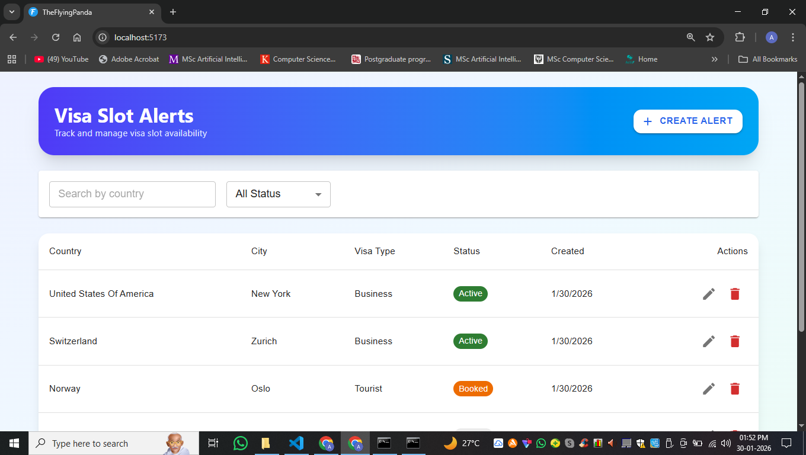

<h2>🐼 Visa Slot Alerts – The Flying Panda</h2> 

A mini internal dashboard built for The Flying Panda to track and manage visa slot alerts efficiently.The application focuses on clarity, structure, and realistic production patterns rather than over-engineering.

 

 
<h2>📦 Features </h2>
<h3>Visa Slots Management</h3>
<ul>
  <li>✅ Create, update, and delete visa slot alerts </li>
<li>🔍 Filter visa slots by country and status.</li> 
  <li>📄 Client-side pagination with selectable rows per page (5 / 25 / 50 / 100)</li> 
  <li>🎨 Modern UI using Material UI + Tailwind CSS</li> 
  <li>🔔 Snackbar notifications (top-right position)</li>
  <li>🧾 Form validation with clear user feedback</li> 
  <li>🎬 Smooth animations using Framer Motion</li> 
  <li>⚡ Loading states and action spinners</li>
</ul>
 
<h2>🏗 What I’d Improve for Production</h2> 
<ul>
  <li>Backend pagination & search indexing</li>
  <li>Authentication & role-based access</li>
  <li>Server-side validation (Joi/Zod)</li>
  <li>Rate limiting & security headers</li>
  <li>Unit & integration tests</li>
  <li>Audit logs for alert changes</li>
  <li>Input validation using Joi/Zod</li>
</ul>

 
<h2>🧠 Design Decisions</h2>
 <ol>
   <li>Single reusable modal for Create & Update to reduce duplication</li>
   <li>Full-screen loading overlays for critical actions to prevent double submissions</li>
   <li>Immediate UI updates after API success (optimistic UX)</li>
   <li>Centralized error handling on backend for maintainability</li>
   <li>Minimal but realistic feature set aligned with internal tools</li>
   <li>Custom Hook (useAlerts) : Centralized all API logic and state management for cleaner components.</li>
   <li>Frontend Pagination : Chosen for simplicity and faster iteration given dataset size.</li>
   <li>Status-driven UI : Status chips and colors improve readability and UX.</li>
   <li>Separation of Concerns: Controllers, services, hooks, and UI components are clearly separated.</li>   
 </ol>
 

<h2>📂 Project Structure</h2> 
frontend/  
src/ 
│ 
├── components/ 
│   ├── AlertForm.jsx 
│   ├── AlertsTable.jsx  
│   ├── AlertsFilter.jsx 
│   ├── simplespinner.jsx 
│   ├── ConfirmDialog.jsx  
│   ├── PageLoader.jsx 
│   ├── StatusChip.jsx 
├── hooks/ 
│   └── useAlerts.js 
│ 
├── pages/ 
│   └── Dashboard.jsx  
│ 
├── services/  
│   └── alerts.api.js  
│ 
├── App.css  
└── App.jsx 
 
backend/  
src/ 
│ 
├── config/ 
│   └── db.js 
│   
├── controllers/ 
│   └── alerts.controllers.js 
│ 
├── middleware/ 
│   ├── error.middleware.js 
│   ├── logger.middleware.js 
│   └── validateAlert.middleware.js  
│ 
├── models/  
│   └── alerts.model.js  
│ 
├── routes/  
│   └── alerts.routes.js  
├── .env 
├── server.js  
└── app.js  
 

<h2>⚙️ Setup Instructions</h2> 
1️⃣ Clone the Repository  
  &nbsp; &nbsp;   o git clone : https://github.com/AyushGhole/TheFlyingPanda.git 
  &nbsp; &nbsp;   o cd backend  
  &nbsp; &nbsp; &nbsp; &nbsp;   - npm install  
  &nbsp; &nbsp;  &nbsp; &nbsp;   - create .env  
  &nbsp; &nbsp;  &nbsp; &nbsp;   - Port=5000 
  &nbsp; &nbsp;  &nbsp; &nbsp;   - MONGO_URI=your_mongodb_connection_string  
  &nbsp; &nbsp;  &nbsp; &nbsp;   - npm run dev   
  &nbsp; &nbsp;   o cd frontend  
  &nbsp; &nbsp;  &nbsp; &nbsp;   - npm install   
  &nbsp; &nbsp;  &nbsp; &nbsp;   - npm run dev
 
<h2>🔗 API Endpoints</h2>

<table>
  <thead>
    <tr>
      <th>Method</th>
      <th>Endpoint</th>
      <th>Description</th>
    </tr>
  </thead>
  <tbody>
    <tr>
      <td>GET</td>
      <td><code>/alerts</code></td>
      <td>Fetch all alerts (with filters)</td>
    </tr>
    <tr>
      <td>POST</td>
      <td><code>/alerts</code></td>
      <td>Create a new alert</td>
    </tr>
    <tr>
      <td>PUT</td>
      <td><code>/alerts/:id</code></td>
      <td>Update an existing alert</td>
    </tr>
    <tr>
      <td>DELETE</td>
      <td><code>/alerts/:id</code></td>
      <td>Delete an alert</td>
    </tr>
  </tbody>
</table>

 
<h2>✅ Assignment Alignment</h2> 
<ul>
  <li>✔ MERN stack used</li>
  <li>✔ CRUD APIs implemented</li>
  <li>✔ Custom middleware & error handling</li>
  <li>✔ Filters supported</li>
  <li>✔ Pagination supported</li>
  <li>✔ Input Validation supported</li>
  <li>✔ Frontend calls own backend APIs</li>
  <li>✔ Clear README with design thinking</li>
</ul>
  
<h2>📊 Data Model</h2 > 
<h4>Each visa alert contains:</h4> 
{  
 &nbsp; "id": "string", 
 &nbsp;  "country": "string", 
 &nbsp;  "city": "string", 
&nbsp;   "visaType": "Tourist | Business | Student", 
&nbsp;   "status": "Active | Booked | Expired", 
&nbsp;   "createdAt": "ISO Date", 
}  
   
<h2>🤖 Where AI Helped vs Human Thinking</h2> 
<h4>AI Helped With:</h4> 
<ul>
  <li>Boilerplate structure</li> 
  <li>Code refactoring suggestions</li> 
  <li>UI improvement ideas</li> 
  <li>Debugging repetitive errors faster</li>
</ul>
<h4>Human Thinking Was Required For:</h4>
<ul>
  <li>Data flow & architecture decisions</li>
  <li>Pagination strategy alignment (frontend vs backend)</li>
  <li>UX decisions (status handling, confirmations)</li>
  <li>Debugging real-world state & async issues</li>
  <li>Matching requirements exactly to the assignment</li>
</ul>

<h2>🚀 Tech Stack </h2> 

 

 

<h3>Deployed Project Link : </h3>
  
    
   <h4>Demo Link : </h4> 
     
